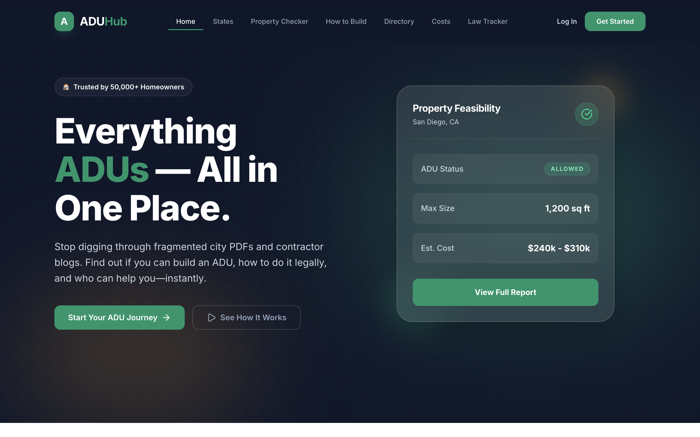
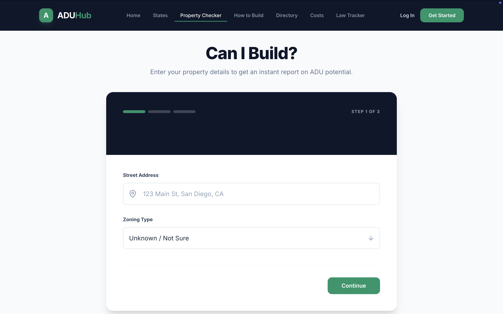
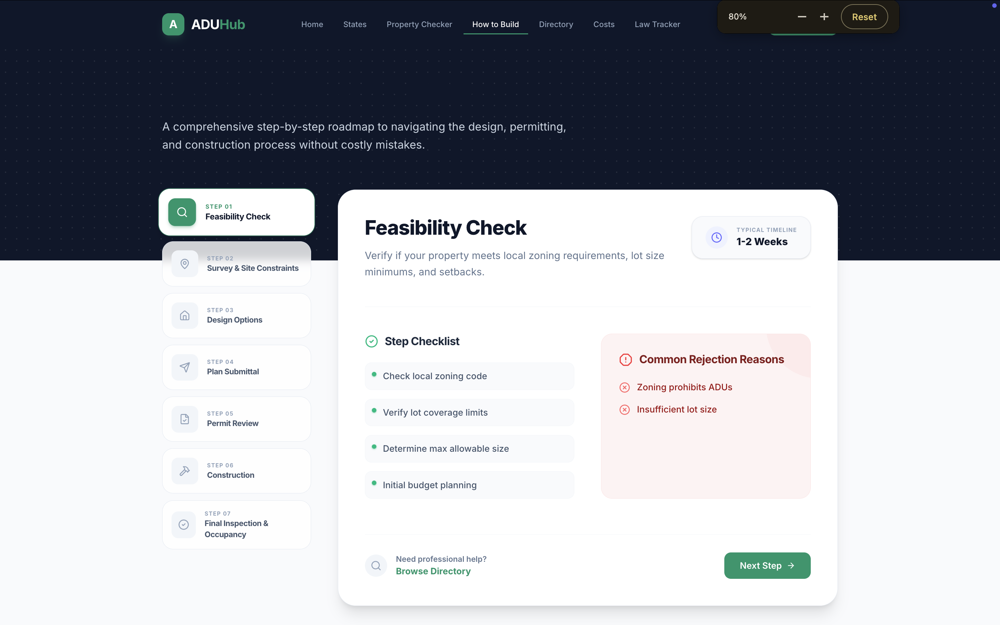
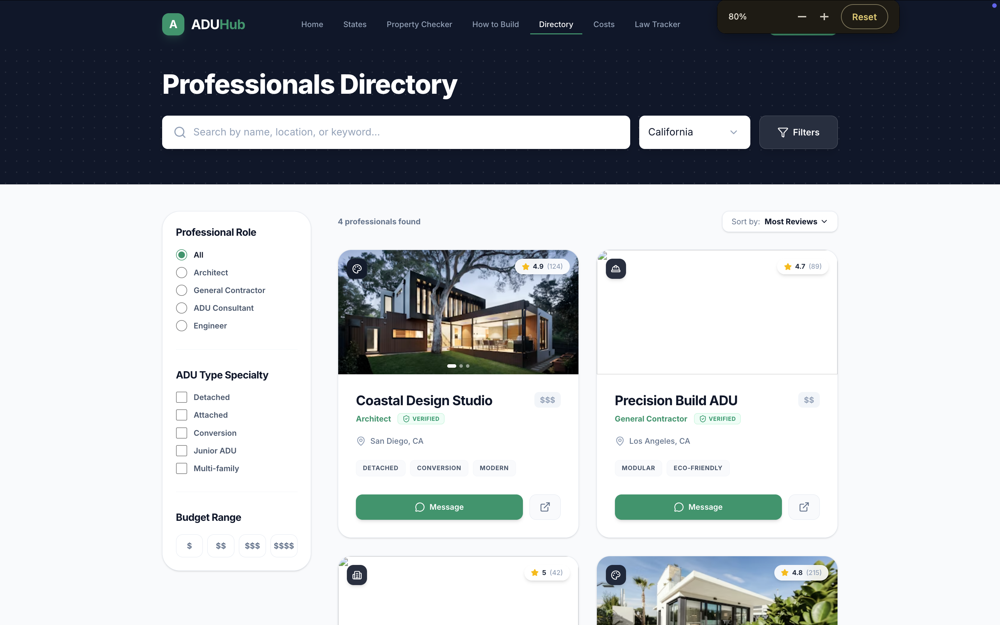
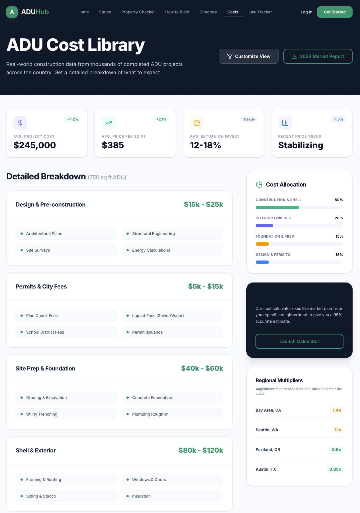
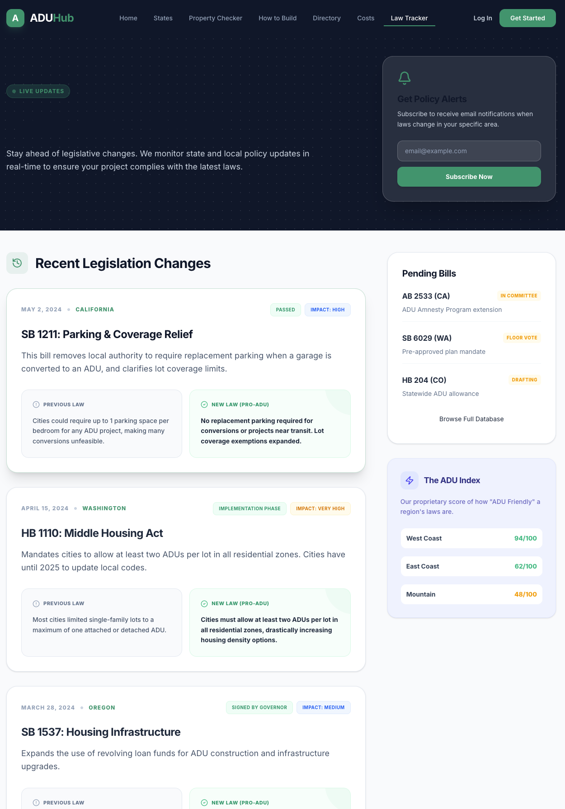
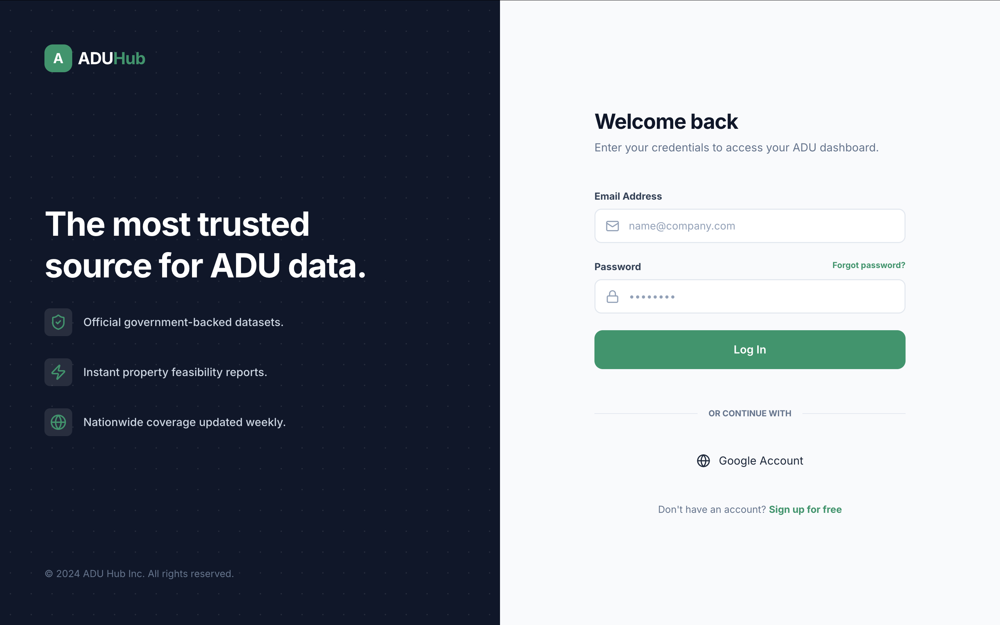

# 🏠 ADU Hub — The All-in-One ADU Platform

**ADU Hub** is a premium, modern platform designed to simplify the complex world of Accessory Dwelling Units (ADUs). It bridges the gap between fragmented city PDFs and homeowners' needs by providing a single, authoritative hub for all things ADU.

> *"Can I build an ADU on my property, how do I do it legally, and who can help me?"*

---

## 🚀 Key Features

### 1. State-by-State ADU Law Database
A comprehensive database of ADU laws across different states and cities. Check legality status, size limits, setbacks, parking requirements, and recent law updates at a glance.

### 2. Property Checker ("Can I Build?" Tool)
A high-value tool that allows users to input their address, lot size, and zoning to get an instant (mock) feasibility report, including estimated costs and approval difficulty.

### 3. Step-by-Step Guided Roadmap
A 7-step guide covering everything from feasibility checks and design options to permit review and final inspection.

### 4. Professional Directory
A curated directory of architects, designers, builders, and prefab companies filtered by location, type, and budget.

### 5. ADU Cost Library
Realistic cost breakdowns including design fees, permit costs, and construction expenses, categorized by area type and ADU style.

### 6. Law Change Tracker & Alerts
Stay updated with the latest changes in ADU legislation. Users can subscribe to alerts for specific states and cities.

---

## 📸 Project Demo

Below are some screenshots of the ADU Hub platform in action:

<div align="center">
  
  
  <br />
  
  
  <br />
  
  
  <br />
  
</div>

---

## 🛠️ Tech Stack

- **Frontend:** React JS
- **Styling:** Tailwind CSS (for modern, premium UI)
- **Animations:** Framer Motion
- **Icons:** Lucide React
- **Routing:** React Router DOM
- **Typography:** Inter (Google Fonts)

---

## 🎨 Design Philosophy

ADU Hub is built with a **Premium & Modern** aesthetic, drawing inspiration from top-tier SaaS products like Notion, Linear, and Stripe.
- **Deep Navy & Emerald Palette** for a trustworthy yet fresh feel.
- **Micro-interactions & Smooth Transitions** for a superior user experience.
- **Glassmorphism & High-Quality Shadows** to add depth and polish.

---

## 🏁 Getting Started

To run the project locally, follow these steps:

1. **Clone the repository:**
   ```bash
   git clone <repository-url>
   ```

2. **Install dependencies:**
   ```bash
   npm install
   ```

3. **Run the development server:**
   ```bash
   npm run dev
   ```

4. **Open in browser:**
   Navigate to `http://localhost:5173`

